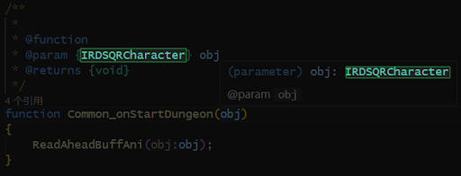
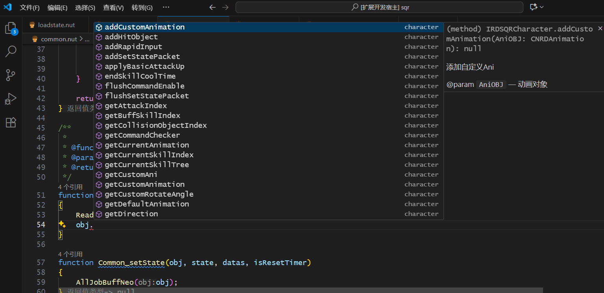
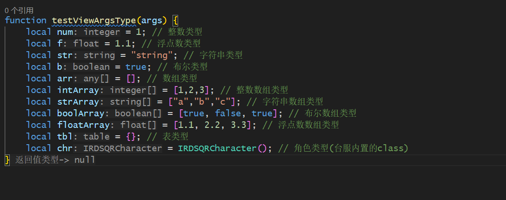

# 我该如何使用TypeSquirrel扩展

本页说明了如何快速开始使用，需要注意的是：使用此扩展需要一定的编程门槛。

## 前提

你需要点击该链接下载最新版本的 [Visual Studio Code](https://code.visualstudio.com/docs/?dv=win64user), 随后打开你的pvf，将sqr文件夹导出到任意位置,最后使用Visual Studio Code打开该文件夹。

* 什么是[Visual Studio Code](https://www.runoob.com/vscode/vscode-intro.html)?

## TypeSquirrel如何识别到class和成员方法？
- 是依赖一种叫`JSDoc`的东西，即：在函数声明上方添加注释文档来指定函数的参数类型、返回值类型，以及函数的含义描述，如下：

  
  此时鼠标光标放置到`obj`参数上时会显示`obj`的类型为`IRDSQRCharacter`，并且可以通过`obj.`调用`IRDSQRCharacter`的成员方法。例如:`obj.getHp()`
  

- 全局函数
  - 对于全局函数，不需要任何JSDoc注释，直接使用即可获得代码补全和类型诊断。
  例如：`sq_getJob(obj)`

- 要如何快速生成JSDoc注释？
  - 没有JSDoc注释的函数会被标记蓝色波浪线，鼠标悬停会提示“添加JSDoc注释”，点击即可自动生成JSDoc注释。

## TypeSquirrel中的类型
- TypeSquirrel 可以通过分析代码中的类型信息，提供更智能的代码补全和错误提示。例如，当你输入一个变量名时，TypeSquirrel 会根据上下文推断出该变量的类型，并提供相应的成员方法和属性供你选择。

- `integer` 整数
- `integer[]` 整数数组
- `float` 浮点数
- `float[]` 浮点数数组
- `bool` 布尔值
- `bool[]` 布尔值数组
- `string` 字符串
- `string[]` 字符串数组
- `array` 数组
- `table` 表
- `function` 函数
- `class` 类

